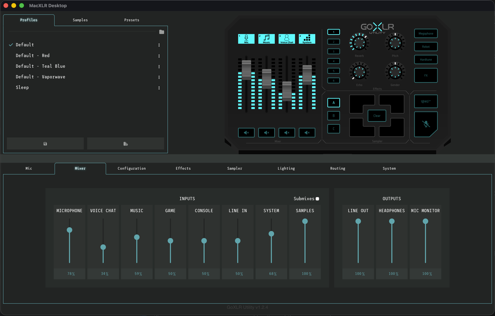

Based on [GoXLR Utility](https://github.com/GoXLR-on-Linux/goxlr-utility)

## MacXLR

MacXLR is a macOS-focused fork of GoXLR Utility for configuring and controlling a TC-Helicon
GoXLR or GoXLR Mini. It is based on the original
[GoXLR Utility](https://github.com/GoXLR-on-Linux/goxlr-utility), but this fork is intended to
evolve independently with macOS-specific fixes, packaging, and quality-of-life improvements.

Project links:

* Repository: [github.com/sergiogallegos/macxlr](https://github.com/sergiogallegos/macxlr)
* Issues: [github.com/sergiogallegos/macxlr/issues](https://github.com/sergiogallegos/macxlr/issues)
* Releases: [github.com/sergiogallegos/macxlr/releases](https://github.com/sergiogallegos/macxlr/releases)

## Features

* Full control over the GoXLR and GoXLR Mini (Similar to the official App)
* Compatibility with profiles created by the official application
* An accessible UI designed to work well with Assistive Technologies
* Remote Access. Control your GoXLR from another computer on your network
* A Sample 'Pre-Buffer'. Record audio from before you press the button
* Exit Actions, including saving profiles and loading other profiles / lighting
* Multiple Device Support. Run more than one GoXLR on one PC
* A CLI and API for basic or advanced scripting and automation
* Streamdeck Integration (
  through [The StreamDeck Repository](https://github.com/FrostyCoolSlug/goxlr-utility-streamdeck))

## Status

MacXLR is currently focused on macOS support and day-to-day usability. The USB control path is
working well, and the fork now includes local macOS app packaging plus additional CoreAudio
recovery work. Some macOS audio-routing behavior is still being refined, so treat the project as
active fork development rather than a finished drop-in replacement for every upstream workflow.

## Downloads

Published builds for this fork should live on the MacXLR releases page:
[github.com/sergiogallegos/macxlr/releases](https://github.com/sergiogallegos/macxlr/releases)

For local development and daily use on macOS, the simplest path is the included local app bundle
script:

```bash
./scripts/build-local-macos-app.sh
open "dist/MacXLR.app"
```

MacXLR remains based on the original GoXLR Utility project, but the packaging, fixes, and fork
direction in this repository are intentionally separate from upstream.

## Native macOS Desktop Shell

This repository now also includes a separate native desktop UI project at
[`desktop-ui/`](/Users/sergiogallegos/projects/goxlr-utility/desktop-ui). It uses Tauri 2 with
React, TypeScript, and Vite to run the existing MacXLR interface inside a native macOS app window
instead of opening a browser tab.

Current scope:

* The desktop shell starts `goxlr-daemon`
* The daemon still serves the existing configuration UI on `http://127.0.0.1:14564/`
* The Tauri app auto-starts into the GoXLR interface and keeps the window presentation clean so it
  feels like a direct macOS app rather than a separate dashboard wrapped around the UI

### Build A macOS App Bundle

To build a macOS desktop app you can drag straight into `/Applications`, run:

```bash
./scripts/build-native-macos-desktop-app.sh
```

This creates:

```bash
dist/MacXLR Desktop.app
```

That app bundle includes the desktop shell plus a bundled `goxlr-daemon` sidecar, so it is ready
for local macOS use after the build completes.

When you launch `MacXLR Desktop.app`, it automatically starts the bundled daemon and opens straight
into the GoXLR interface inside the native macOS window.

Native macOS desktop app:



For desktop-shell development without producing a release app bundle:

```bash
./scripts/run-native-macos-desktop.sh
```

## Integrations

* [twitchat](https://twitchat.fr/) - Activate and change GoXLR settings based on twitch bits / donations (Thanks Durss!)
* [MacroGraph](https://www.macrograph.app/) - A visual programmer for Streamers. (Thanks JDUDE!)
* [OBS Fader Sync](https://github.com/parzival-space/obs-goxlr-fader-sync-plugin) - An OBS plugin to sync pre-mix
  volumes to fader volumes (Thanks parzival!)
* [Home Assistant](https://github.com/timmo001/homeassistant-integration-goxlr-utility) - A plugin that lets you tie the
  GoXLR into your home automation (Thanks timmmo!)

## Getting Started

Once installed, you can launch the app using the `MacXLR` item in your Applications folder or app
launcher. That starts the daemon and opens the configuration UI. The UI is then accessible through
the tray icon or, if you do not have a tray, by launching `MacXLR` again.

If you want to import your profiles from the official app, simply click on the folder icon in the top right of the
relevant profiles pane (either Main or Mic) which will open the directory in your file browser. Copy the profile across
from the Official App's directory (normally `Documents/GoXLR`) and they'll appear in the util ready to load, simply
double click them.

If you're setting up from scratch, the best place to start is configuring your microphone. Head over to the `Mic` tab
and hit `Mic Setup` to configure your microphone type and gain. It may be easier to configure if you first set your
Gate Amount to 0, then reconfigure it once your mic is working. Once done, go explore the UI!

## The UI

MacXLR serves a web UI directly from the daemon and can also wrap that UI in a dedicated app on
macOS. The interface stays close to the official GoXLR application so existing users do not have
to relearn the mixer from scratch.


MacXLR is currently macOS-first. If you are working from upstream on Linux or Windows, use the
original GoXLR Utility project and its platform-specific packaging.

## Building

Build instructions for the original project can still be useful as reference:
[GoXLR Utility compilation guide](https://github.com/GoXLR-on-Linux/goxlr-utility/wiki/Compilation-Guide).
MacXLR may diverge from upstream packaging and macOS behavior over time.

### Local macOS App Bundle

If you're working on the utility locally on macOS and want a simple `.app` bundle for daily use,
this repo now includes a local packaging script:

```bash
./scripts/build-local-macos-app.sh
open "dist/MacXLR.app"
```

This produces a local app bundle containing the Rust binaries from `target/release/`. It does not
build the separate Tauri desktop UI project or a signed `.pkg`, but it gives you a native-feeling
launcher for local testing and personal use on macOS.

## Support

If you hit a MacXLR-specific bug or regression, file it here:
[github.com/sergiogallegos/macxlr/issues](https://github.com/sergiogallegos/macxlr/issues)

If the problem is clearly upstream behavior or general GoXLR Utility behavior unrelated to this
fork, the original project may still be the right reference:
[github.com/GoXLR-on-Linux/goxlr-utility](https://github.com/GoXLR-on-Linux/goxlr-utility)

## Disclaimer

This project is also not supported by, or affiliated in any way with, TC-Helicon. For the official GoXLR software,
please refer to their website.

In addition, this project accepts no responsibility or liability for use of this software, or any
problems which may occur from its use. Please read the [LICENSE](LICENSE) for more information.
